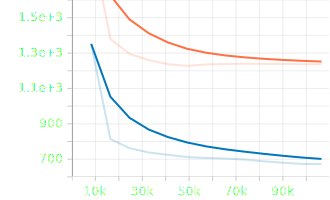

# HNX‑M — Research Release

**A Dual‑Strand, Entropy‑Gated Neural Architecture for Memory‑Efficient Sequence Learning**

HNX‑M is a **patent‑pending**, biologically‑inspired sequence model designed to deliver **stable, adaptive, and efficient long‑term memory** in sequence learning tasks.  
It introduces a *double‑helix‑like* processing structure with forward and backward strands, a shared memory ladder, and entropy‑driven control systems; achieving faster convergence and more selective recall than baseline architectures.  

Released for **non‑commercial research only** — see [Patent Status & Licensing](#patent-status--licensing).

---

## Overview

While modern sequence models — Transformers, GRUs, and Mamba‑style SSMs — have pushed accuracy and scale, they often struggle to maintain **stability**, **memory efficiency**, and **convergence speed** over long contexts.

HNX‑M addresses these limitations by structuring computation around:

- **Two coordinated processing strands**  
  A forward strand and a backward strand process the same sequence in opposite directions, enabling bidirectional context without transformer‑style quadratic costs.

- **A shared “memory ladder”**  
  Learnable rungs act as long‑term storage, accessible from both strands for consistent recall across the entire sequence.

- **Entropy‑aware control systems**  
  Dynamic gating adjusts memory access, torsion (positional twist), and dropout according to internal model certainty, preventing noisy recalls from destabilising learning.

- **Asymmetric read/write specialisation**  
  Separate projection pathways for each strand encourage complementary roles, improving selective attention to relevant information.

The result is a sequence architecture that converges faster, recalls more precisely, and sustains performance in environments where standard architectures degrade.

Full design details, biological analogies, and results are available in the [research notebook](notebooks/hnx_m_research.ipynb).

---

## Repository Contents

```text
notebooks/hnx_m_research.ipynb     # Annotated research notebook
figures/                           # Architecture diagram, plots, visualisations
hnx_m.py                           # Public top-level model structure (core omitted)
logs/minigrid_ppo_test1/           # TensorBoard logs for first Minigrid PPO benchmark
requirements.txt                   # Minimal deps to view/run notebook
LICENSE
```

---

## Structural Features — Performance Mapping

| Feature                        | Mechanism                                    | Impact                            | Observed Outcome                  |
| ------------------------------ | -------------------------------------------- | --------------------------------- | --------------------------------- |
| Dual Strand (Fwd/Bwd)          | Causal conv1d + reversed scan, entropy‑gated | Bidirectional memory & recurrence | Faster convergence                |
| Memory Ladder                  | Slot‑based w/ learned decay & Δt bias        | Long‑term recall & stability      | No performance dip over time      |
| Gated Memory Injection         | Sigmoid‑gated memory read                    | Precision of recall               | Avoids overwriting useful signals |
| Entropy‑Gated Backward Scaling | Entropy→scalar modulation                    | Backward relevance filtering      | Prevents destabilising noise      |
| Asymmetric Slot Projection     | Separate fwd/bwd slot projections            | Strand specialisation             | Divergent focus per strand        |
| Per‑Slot Write Strengths       | MLP([entropy, Δt]) modulation                | Adaptive learning per slot        | Best accuracy to date             |
| Positional Biasing via Δt      | Learned dt_bias for fwd/bwd                  | Temporal sensitivity              | Removes mid‑training jitter       |
| Torsion Gate Projection        | Torsion‑split projection w/ gating           | Signal sharpening                 | Reduces early noise               |
| Fusion Weights (Learned)       | Learnable [fwd, bwd, mem] weighting          | Adaptive decoding                 | Balances pathways dynamically     |

---

## Explore the Training Logs

Interactive TensorBoard logs for the **first Minigrid PPO benchmark** are available in  
[`logs/minigrid_ppo_test1`](logs/minigrid_ppo_test1).

```bash
tensorboard --logdir logs/minigrid_ppo_test1
```

Then open [http://localhost:6006](http://localhost:6006) in your browser.

> Hardware: RX 7900 XTX (AMD RDNA3 / ROCm) + Ryzen 7 7800X3D (8 threads)
> Environment: `MiniGrid-GoToObject-8x8-N2-v0`
> Timesteps: 100,000 | Parallel envs: 4

---

### Performance vs CNN Baseline

*Note: Core model weights and the full proprietary training code are excluded from this release.*



> Frames-per-second over time for HNX‑M_v4 compared to a CNN baseline in the  
> `MiniGrid-GoToObject-8x8-N2-v0` PPO benchmark.

---

## Patent Status & Licensing

**Title:** HNX‑M: A Dual‑Strand, Entropy‑Gated Neural Architecture for Memory‑Efficient Sequence Learning  

This architecture is the subject of a **pending patent application** (provisional stage).  
It is released **solely** for academic research, peer review, and non‑commercial experimentation.

Any commercial use — including integration into products, services, or corporate R&D pipelines — is **strictly prohibited** without prior written permission and a licensing agreement.

Covered in the patent application:
1. Dual forward/backward strand processing.
2. Shared memory ladder with rung‑based gating.
3. Entropy‑based modulation for memory access, torsion injection, and dropout.
4. Output projection combining forward, backward, and memory vectors.

See the [full claims and description](notebooks/hnx_m_research.ipynb) in the research notebook.  
Please read the [LICENSE](LICENSE) file for permitted uses.

---

## Notes

* Intended for research visibility, portfolio demonstration, and academic discussion.
* Core implementation (`core/` modules) is proprietary and **not** included.
* For licensing or collaboration enquiries, please contact via [GitHub profile](https://github.com/piestyx).

---